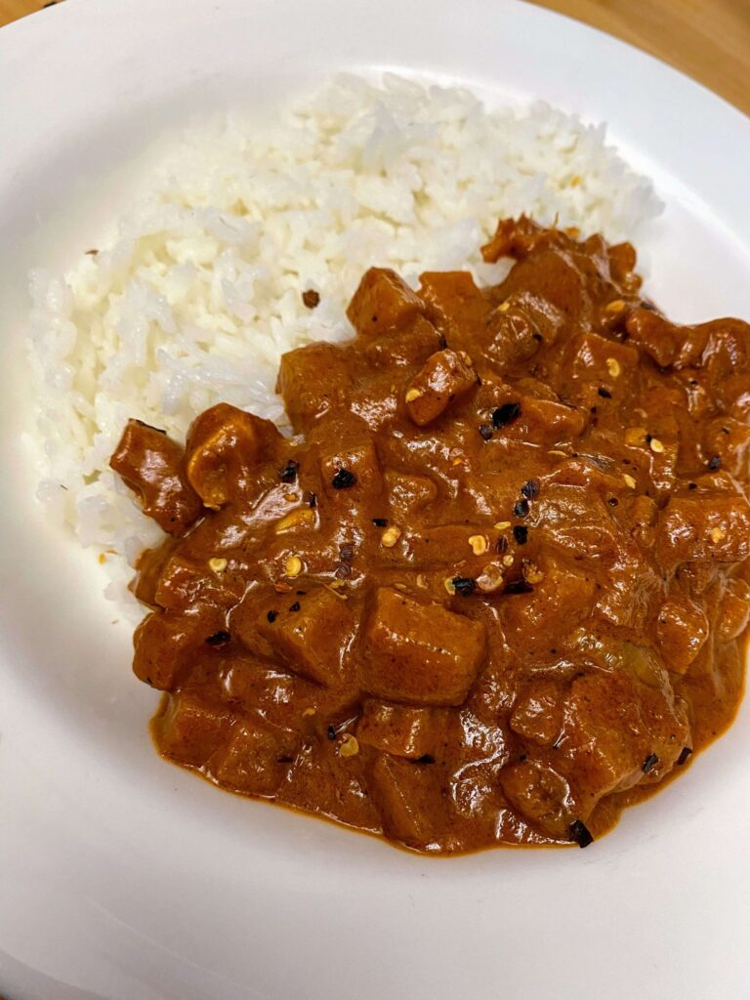

When [I posted about this box to twitter last week, it seemed to make some people upset.](/foodshare-dismantling-white-supremacy-box/) I don't know if it's the name that triggered their ire, but they complained about the price of this box and shared my post so that I could get a bunch of angry messages about it for no good reason. After thinking about it, I don't really take issue with the price or the contents on any level, but ultimately that's my call to make.

I realize that sometimes people just don't buy a bunch of vegetables on a regular basis, so they may not know how much things cost in stores or otherwise, but getting this box delivered and the contents, is easily worth it to me, for convenience alone. We eat a lot of vegetables when we get this box, because the leafy greens are super fresh and in perfect condition. As an added benefit, it encourages us to be more creative with our meals - which is something a novelty seeker like me, really benefits from.

FoodShare also has a [large conventional produce box](https://goodfoodbox.foodshare.net/collections/frontpage/products/large-box) we get when this box is not available, and it's incredibly good value for the money.

## What did we make last week?

I found it really helpful to have a bunch of ideas for our box contents, and I did refer to it through out the week when I was thinking about what to make.

- 

Some recipes we really enjoyed with our delivery last week were this [Sri Lankan Beet Root Curry](https://savoryspin.com/beetroot-curry-5/), and I used our bountiful beet greens to make roast beet and kale chips. I made [Okonomi Kitchen's Zucchini Pad Thai,](https://okonomikitchen.com/pad-thai-zucchini-noodles-with-jackfruit-chicken/) but with tofu and some added rice noodles - her sauce was stellar and easy to make with things we had in the house.I cut the broccoli leaves and some of the swiss chard chiffonade style and broccolini for a simple addition to a biscuit and onion gravy breakfast this weekend and it was just wonderful [using this recipe from Sweet Potato Soul.](https://sweetpotatosoul.com/vegan-southern-collard-greens/) I ended up using the rest of the swiss chard leaves in an [Meatless Efo Riro](https://jegbese.com/vegan-no-meat-nigerian-efo-riro/) recipe I love from Jegbese, and the swiss chard stems were made palatable by quick pickling them! I didn't manage to do anything with the mizuna other than throw it into a stir fry. I'll have to try it again another time.

## What's in the box this week:

- 1 bunch Organic Efo Shoko
- 1 bag Organic Perilla
- 1 Organic Cucumber Field
- 1 bag Organic Pole Beans
- 1 bunch Organic Chard Red/Green 
- 1 bunch kale\*\*
- 1 Organic Tokyo Bekana
- 1 bunch organic Spring onions\*\*
- 1 pint Organic Shishito Pepper
- 1 organic zucchini\*\*

So unfortunately, I don't get a box this week, because I placed my order wrong, but I had already started collecting recipes in anticipation, so perhaps my work wont be wasted, and if anyone needs the suggestions, they're here!

I [read a whole bunch about different Nigerian greens today](https://9jafoodie.com/nigerian-leafy-vegetables/) - and **Efo Shoko** is also sometimes known as Lagos Spinach or Shokoyokoto in Yoruba. It is similar to callaloo (but not callaloo) and can be used like spinach. I am likely to make another efo riro (it is really incredible) with this or this [egusi soup from the Vegan Nigerian](https://www.vegannigerian.com/2020/10/vegan-egusi-recipe-how-to-make-nigerian.html). In case you want to get egusi seeds and you live in Toronto, I get them from MyChopChop but you can find them at any African grocery store.

**Perilla** is not something I've had before, but something I've heard of on and off as a potential pickled leaf, primarily in Korean cuisine. I was grateful to find a [vegan recipe for this Pickled Perilla Leaf from the Korean Vegan](https://thekoreanvegan.com/another-kind-sort-kimchi-pickled-perilla-leaf/), and I'm looking forward to trying it. Another idea for the perilla is this fantastic looking [Korean Mushroom Lettuce Wrap from Christie At Home](https://christieathome.com/blog/korean-mushroom-lettuce-wraps/) (I suspect this one will also pair really wonderfully with the pickled radish or kohlrabi I got from [Hansomm Chef](https://www.hansommchef.com/) at the [Waldorf Market](https://www.villagemarket.ca/) last weekend.)

When I saw the **cucumber** this week, my brain instantly went to [cucumber raita](https://www.thecuriouschickpea.com/vegan-raita-indian-cucumber-and-mint-yogurt-sauce/) and I pairing it with aloo **pole beans** with [this green bean curry](https://ministryofcurry.com/green-bean-curry/) from Ministry of Curry. (and maybe [make some roti](https://www.cookwithmanali.com/roti-recipe/).) I'd also probably try the pole beans in this summer salad from Oh My Veggies

**Shishito Peppers**, if you've never had shishito peppers, these are a mildly spicy pepper with the occasional super spicy pepper. My favourite thing to do with them is throw them in the cast iron pan with some oil and salt. They don't need anything else,

I had good luck incorporating the **chard greens** into the Efo Riro, and I also liked the pickled stems. I'm trying to make sure I incorporate more green leafy vegetables, chard is a great source of vitamin k. Another option for chard use is this nice looking  [Chickpea and Chard Stew from Produce on Parade](https://www.produceonparade.com/produce-on-parade/chickpea-chard-stew)

**Tokyo Bekana** is similar to napa cabbage, bok choy, or pak choy and can be used in stir fries and as a tender salad green and more. There are also a few Bekana specific recipes, I liked this [rice bowl slaw idea from Red Wagon Farm](https://redwagonfarmboulder.com/2018/05/27/tokyo-berkana-rice-bowl-slaw/), especially since we love rice bowls over here, they also offer a few other suggestions, and more information about bekana.  

Looking forward to next Thursday when we can get our box again. This week without the box was definitely much lower in leafy green vegetable consumption!
